STA 518 Final Project
================
Joel Smith
12/10/2018

#### 1. Make one appropriate exploratory graph of the response variable against each explanatory variable (for a total of 6 graphs) and note any interesting or troublesome features. If any transformation of the response variable is needed, now would be the time to implement it. If you implement a transformation, you should graphically confirm that it was reasonably successful.

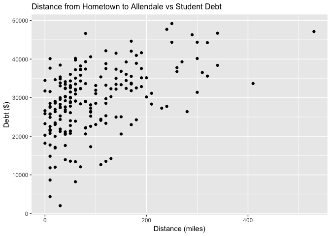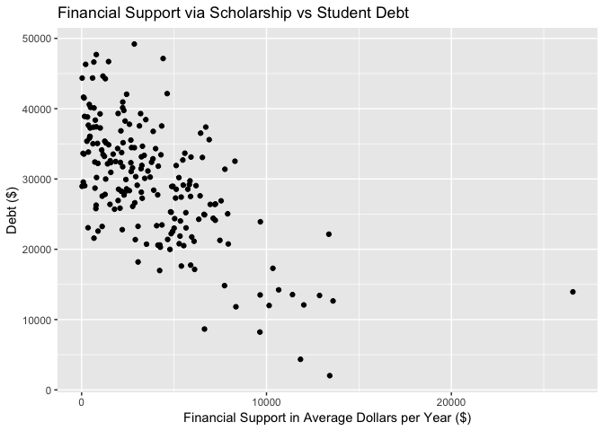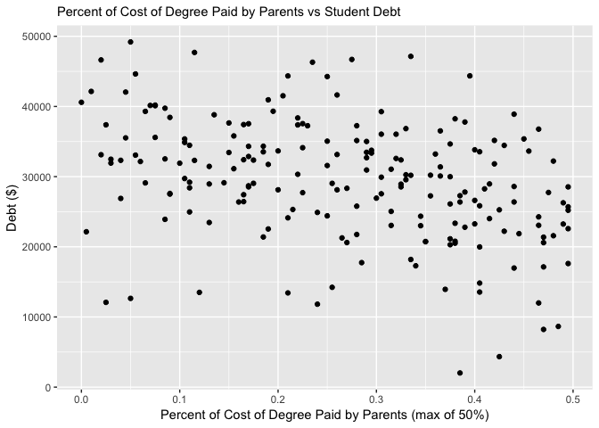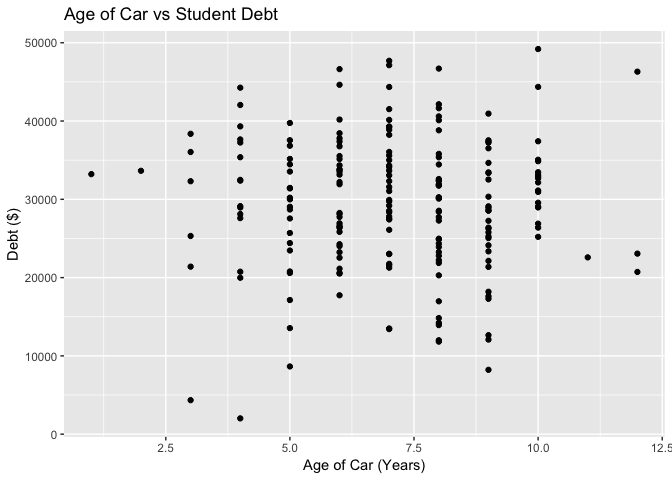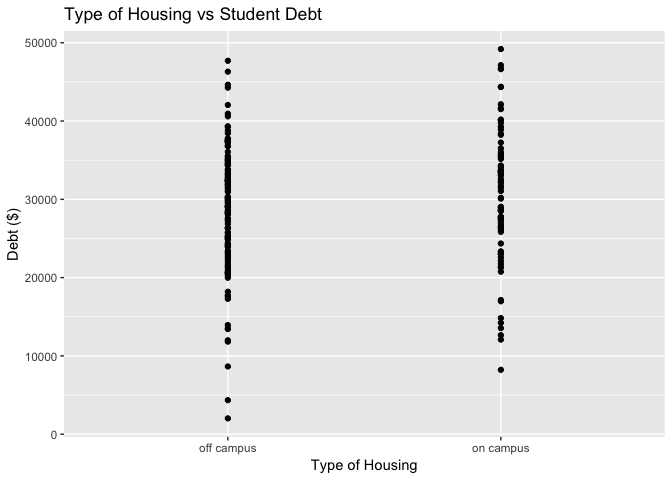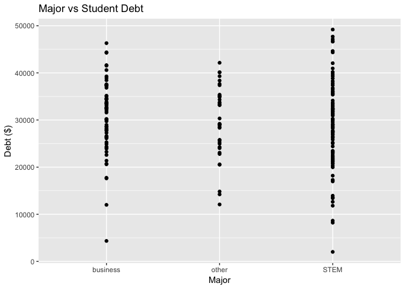

There appears to be an outlier on the debt vs. distance plot, and one on the debt vs. scholarship plot as well.

The plot of distance and debt shows what is not quite a linear relationship, so a square root transformation of distance was completed. The plot below shows how the transformed relationship is much more linear.

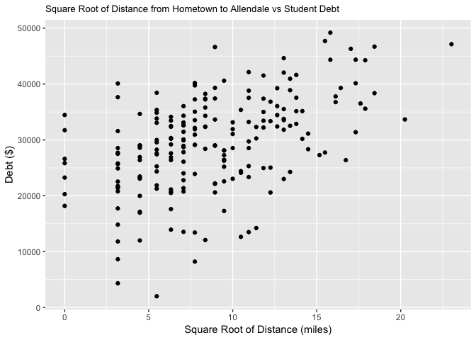

#### 2. Manually create dummy (indicator) variables for categorical explanatory variables. You should use these dummy variables in the rest of the project, in place of the original categorical explanatory variables. You must use the reference group listed in the description of the data in the creation of the dummy variables. You should give an explanation of how you created your dummy variables, and why you had the particular number of them that you did, as if you were explaining to one of your classmates.

``` r
# create housing dummy variable - "off campus" as reference
mydata %>%
  mutate(dhous = ifelse(housing == "on campus", 1, 0)) %>%
  select(-housing) -> mydata

# create major dummy variable - "other" as reference
mydata %>%
  mutate(dSTEM = ifelse(major == "STEM", 1, 0),
         dbusiness = ifelse(major == "business", 1, 0)) %>%
  select(-major) -> mydata
```

The code above creates dummy, or indicator, variables for the categorical variables housing and major. For housing, which has two levels, one dummy variable is needed, as the levels of it will explain the levels of housing. The dummy variable *dhous* is set to 1 when housing is "on campus" and 0 when housing is "off campus." This makes "off campus" the reference group.

The variable major has three levels, so we need two dummy variables. The dummy variable *dSTEM* is set to 1 when major is "STEM" and 0 otherwise. The dummy variable *dbusiness* is set to 1 when major is "business" and 0 otherwise. This makes "other" the reference group, when *dSTEM* and *dbusiness* are both 0.

#### 3. Write a function to implement a best subsets approach to model selection (allowing for any number of explanatory variables, which would include all dummy variables and none of the original categorical variables, because they are replaced by the dummy variables), using a linear model, where r-square is the criterion you will use to pick the best model. You may assume that the data will always have columns in the order Y, X1, X2, ..., Xp (where Y is the response variable), and that the data are always “clean”. The only input to the function should be the data set.

The function *modelSelect* takes a dataset with the first variable being the response. It first initializes an empty tibble to be filled as it loops over and creates a model for each combination of explanatory variables. Within this table, the highest value of R<sup>2</sup> for each number of explanatory variables is flagged. The output tibble is created from a subset of the tibble inside the function, followed by a plot produced by ggplot. These are then both printed from the function.

#### 4. Choose the best model for the data set called finalprojectdata.csv, based on R<sup>2</sup> by applying your function in the previous part. In other words, you want to balance having higher values of R<sup>2</sup>, against having an unnecessarily complicated model. Put another way, don’t pick a model that is more complicated (more explanatory variables in the model) if there is not “significant” gain in R<sup>2</sup>, relative to simpler models. You can decide what a “significant” gain is, but you should clearly explain what that is and how you used it. Be sure to write the equation of your final model using the variable names.

    ## # A tibble: 127 x 3
    ##    ModelNumber ExplanatoryVariables   Rsquared
    ##          <dbl> <chr>                     <dbl>
    ##  1           1 sship                0.413     
    ##  2           2 parents              0.141     
    ##  3           3 car                  0.00000746
    ##  4           4 distSQRT             0.246     
    ##  5           5 dhous                0.00977   
    ##  6           6 dSTEM                0.0102    
    ##  7           7 dbusiness            0.0106    
    ##  8           8 sship parents        0.566     
    ##  9           9 sship car            0.414     
    ## 10          10 sship distSQRT       0.618     
    ## # … with 117 more rows

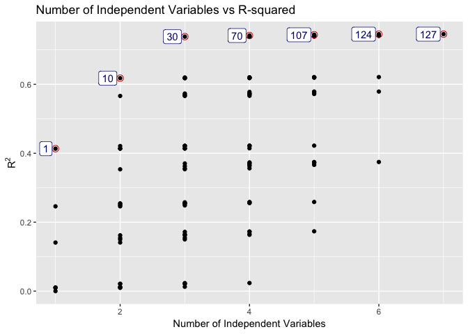

    ## Adding missing grouping variables: `indvarcount`

    ## # A tibble: 7 x 4
    ## # Groups:   indvarcount [7]
    ##   indvarcount modelnum    r2 frm                                           
    ##         <dbl>    <dbl> <dbl> <chr>                                         
    ## 1           1        1 0.413 debt ~ sship                                  
    ## 2           2       10 0.618 debt ~ sship + distSQRT                       
    ## 3           3       30 0.738 debt ~ sship + parents + distSQRT             
    ## 4           4       70 0.742 debt ~ sship + parents + distSQRT + dbusiness 
    ## 5           5      107 0.744 debt ~ sship + parents + distSQRT + dSTEM + d…
    ## 6           6      124 0.746 debt ~ sship + parents + distSQRT + dhous + d…
    ## 7           7      127 0.746 debt ~ sship + parents + car + distSQRT + dho…

    ## [1] 34184.24

    ## [1] -1.554576

    ## [1] -21319.31

    ## [1] 801.3509

The first table contains the model number, the list of explanatory variables in that model, and the R<sup>2</sup> for that model.

Looking at the plot we can see that model 30 with three explanatory variables has a fairly high R<sup>2</sup> value which doesn't increase much as the number of explanatory variables increases. Model 127 has the highest R<sup>2</sup> value, but it also is the most complex model, as it includes every explanatory variable. The difference in R<sup>2</sup> between models 127 and 30 is only 0.0073. This difference is small enough that I feel model 30 is the best balance between a high R<sup>2</sup> value and model complexity.

The second table contains the model number, R<sup>2</sup>, and the formula for the model that has the highest R<sup>2</sup> for each number of independent variables.

The four numbers printed after the second table are the coefficients for the terms intercept, scholarship, parents, and $\\sqrt{distance}$, respectively, in model 30.

Therefore, the model is:

$\\hat{Debt} = 34184.24 - 1.55(Scholarship) - 21319.31(Parents) + 801.35($$\\sqrt{Distance}$)

#### 5. Examine the residuals from the model that you chose as your best model. Note any interesting or troublesome features. Normality of residuals is not critical since we did not do any statistical inference. However, outliers, constant variance (homoscedasticity), non-random patterns, etc. are appropriate to look for.

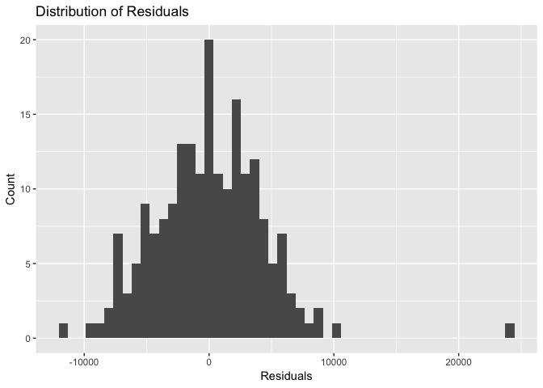

The majority of the residuals look normally distributed, although there is one point that has a very large residual. This is not an issue since we are not making statistical inference.

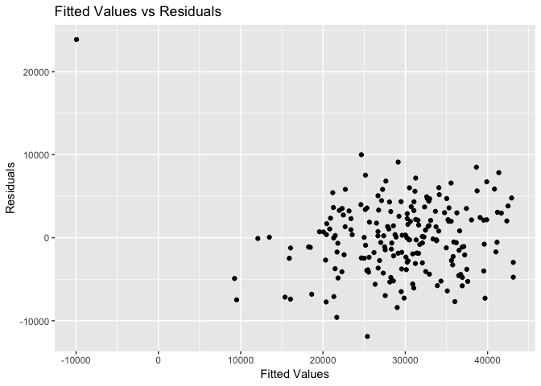

However, that same point is an outlier on the fitted values vs residuals plot. Other than this point, the residuals look relatively equally dispersed about zero and their spread is constant as the fitted values increase. The points with fitted values between 10,000 and 20,000 do tend to have negative residuals. If this study were to go further and involve statistical inference, I would remove the outlying point and rerun the model.

#### 6. For the model with only scholarship, parents, and housing in the model, fit a single model that also contains (two-way) interaction terms for housing and scholarship, and for scholarship and parents, i.e. it has 5 terms in the model. Include appropriate graphics looking at residuals. Interpret the slopes of these two interaction terms in context and illustrate them with graphics.

    ## 
    ## Call:
    ## lm(formula = debt ~ sship + parents + dhous + sship:dhous + sship:parents, 
    ##     data = mydata)
    ## 
    ## Residuals:
    ##      Min       1Q   Median       3Q      Max 
    ## -11404.5  -3698.3   -395.1   3113.1  19434.5 
    ## 
    ## Coefficients:
    ##                  Estimate  Std. Error t value             Pr(>|t|)    
    ## (Intercept)    42102.5169   1509.6160  27.890 < 0.0000000000000002 ***
    ## sship             -1.7076      0.3028  -5.640        0.00000005946 ***
    ## parents       -28272.9899   4524.9025  -6.248        0.00000000258 ***
    ## dhous           3464.5568   1261.3746   2.747              0.00659 ** 
    ## sship:dhous       -0.5095      0.2585  -1.971              0.05011 .  
    ## sship:parents      0.9345      0.8587   1.088              0.27783    
    ## ---
    ## Signif. codes:  0 '***' 0.001 '**' 0.01 '*' 0.05 '.' 0.1 ' ' 1
    ## 
    ## Residual standard error: 5510 on 194 degrees of freedom
    ## Multiple R-squared:  0.589,  Adjusted R-squared:  0.5784 
    ## F-statistic:  55.6 on 5 and 194 DF,  p-value: < 0.00000000000000022

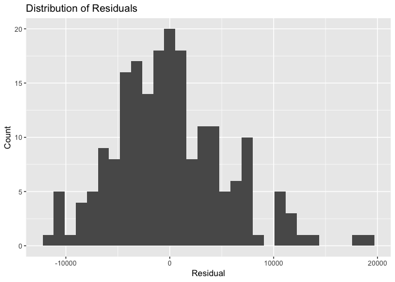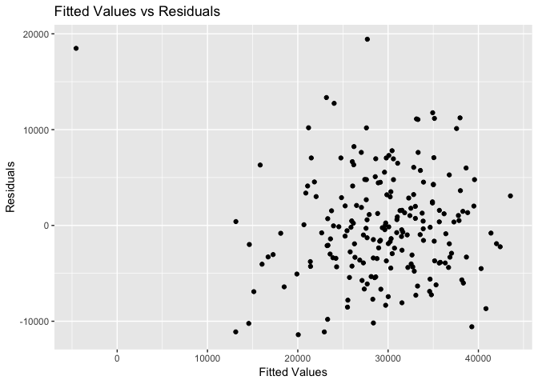

The residuals for this model look normally distributed, with a couple of points with large residuals. There is no noticeable pattern to the residuals vs. the fitted values, as they seem to be evenly scattered about zero. There is still the one point that is an outlier.

The equation for the model is:

$\\hat{Debt} = 42102.52 - 1.71(Scholarship) - 28272.99(Parents) + 3464.56(dhous) - 0.51(Scholarship:dhous) + 0.93(Scholarship:Parents)$

The slope for *Scholarship:dhous* is -0.51. This means that for students who live off campus (dhous = 0), the effect of financial support per year from a Scholarship is -1.71 - 0.51(0) = -1.71, and for students who live on campus (dhous = 1), the effect of financial support per year from a Scholarship is -1.71 - 0.51(1) = -2.22. So a student who lives on campus is expected to have more debt. The effect of housing type for students who live on campus is 3464.56(1) - 0.51(1) = 3464.05. This means that for students who have the same amount of financial support per year from scholarships, the student who lives on campus is expected to have $3464.05 more debt. The first plot below shows how an on campus living situation has a steeper negative slope. The fact that the lines intersect is evidence that an interaction is present. For students without a scholarship, those who live on campus are expected to have more debt. However, as the amount of scholarship increases, students who live off campus are expected to have more debt.

The slope for *Scholarship:Parents* is 0.93. This means that for a constant amount of financial support from scholarships per year, an increase of 1% of the total cost of bachelor's degree paid by the student's parents results in an expected -1.71 + 0.93 = -0.78, or $0.78 less debt. Alternatively, for a constant percentage of the bachelor's degree paid by the student's parents and a $1 increase in scholarship, the expected debt is then -28272.99 + 0.93 = -28272.06, or $28,272.06 less debt. The plot below of the interaction between scholarship and parents groups values of the parents variables. The ranges are 0 to 0.180, 0.181 to 0.330, and 0.331 to 0.495. The lines for these groups are not parallel, suggesting an interaction between parents and scholarship.

However, neither of the interaction terms are significant, so statistical inference made from this analysis is not recommended. This means that there is not significant evidence that the slope for either interaction term is not equal to zero.

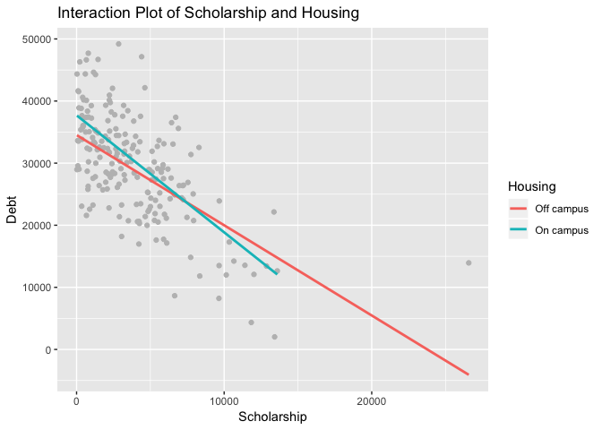

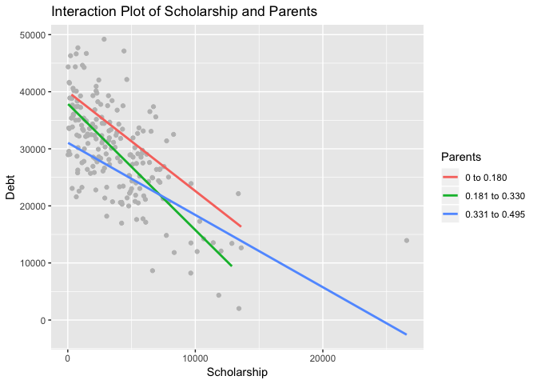
